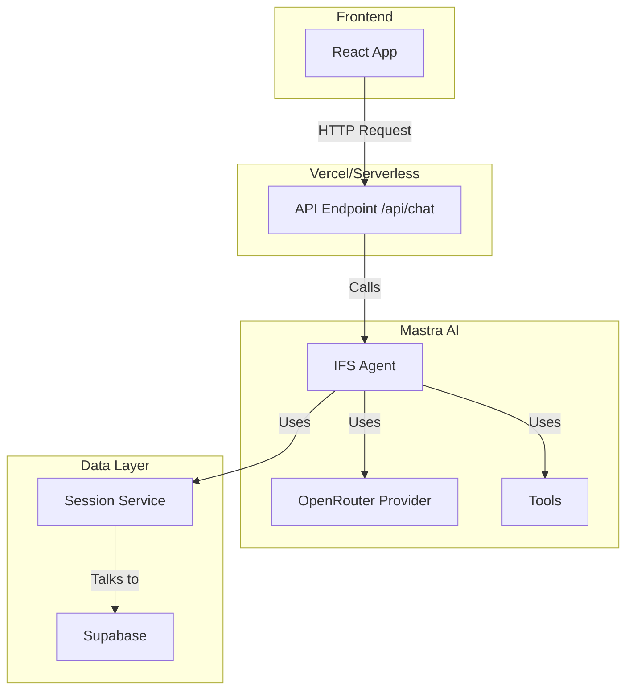
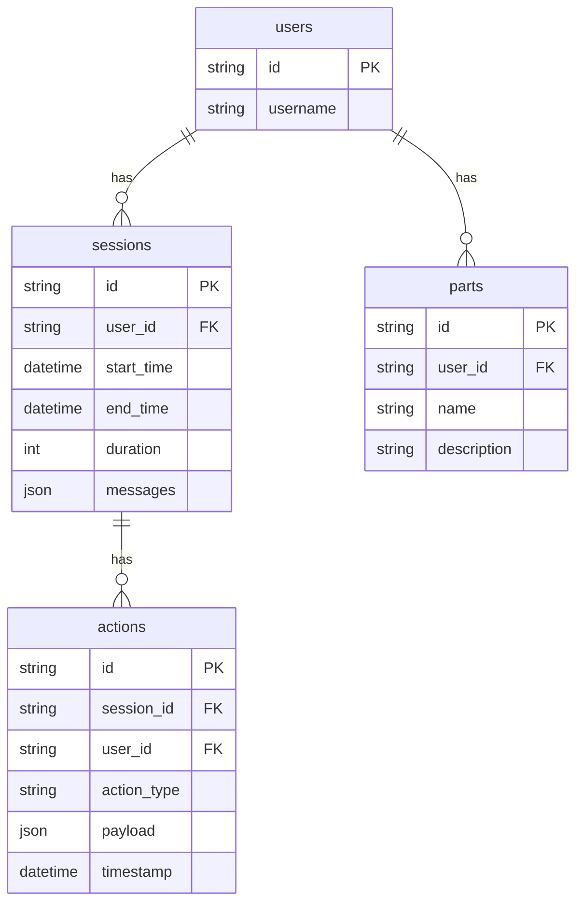
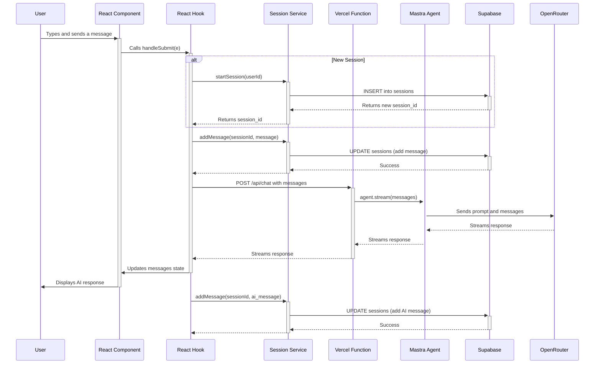

<!--
NOTE: This document is retained for historical context and is out of date.
Please see docs/SystemDesign.md for the current source of truth.
-->

# Technical Design: IFS Therapy Companion

This document outlines the technical design of the IFS Therapy Companion, a web-based chat application that uses a large language model (LLM) to act as an Internal Family Systems (IFS) companion.

## 1. High-Level Architecture

The application is a modern full-stack web application with a React frontend, a serverless backend, and a Supabase database. The core AI logic is powered by the "Mastra" framework, which orchestrates the interaction between the user, the LLM, and the application's tools.

### Component Diagram

### Key Components:

*   **Frontend:** A single-page application (SPA) built with React, TypeScript, and Vite. It uses Tailwind CSS for styling.
*   **Backend:** A Vercel serverless function that acts as a proxy to the Mastra agent.
*   **AI Agent:** A Mastra agent that uses an LLM from OpenRouter to generate responses. The agent is equipped with a set of tools to manage the conversation and interact with the database.
*   **Database:** A Supabase (Postgres) database that stores chat sessions, messages, and user-specific data related to their internal "parts".
*   **Mastra Framework:** A framework that simplifies the creation and management of AI agents and their tools.

## 2. Frontend

The frontend is a React application built with Vite. The main entry point is `src/main.tsx`, which renders the `App` component.

### `App.tsx`

This is the root component of the application. It's responsible for rendering the `ChatInterface` component and providing it with the user's ID.

### `components/ChatInterface.tsx`

This component provides the main user interface for the chat. It displays the chat history and a form for sending new messages. It uses the `useSessionChat` hook to manage the chat state and interactions.

### `hooks/useSessionChat.ts`

This is the most important hook in the frontend. It encapsulates the logic for managing the chat session and interacting with the backend.

*   **Wraps `@ai-sdk/react`'s `useChat` hook:** It uses the `useChat` hook from the AI SDK to handle the basic chat functionality, such as managing the message list, input state, and form submission.
*   **Session Management:** It adds a layer of session management on top of `useChat`. It uses the `chatSessionService` to:
    *   Start a new chat session when the user sends their first message.
    *   Load existing chat sessions.
    *   End the current chat session.
    *   Save user and assistant messages to the database.
*   **API Interaction:** It sends chat requests to the `/api/chat` endpoint.

## 3. Backend

The backend is a single Vercel serverless function located at `api/chat.ts`.

### `api/chat.ts`

This function is responsible for handling chat requests from the frontend.

*   **Receives Messages:** It receives the message history from the frontend in the request body.
*   **Invokes the Mastra Agent:** It calls the `ifsAgent.stream()` method, passing the message history to the agent.
*   **Streams the Response:** It streams the agent's response back to the frontend using `stream.toDataStreamResponse()`. The Mastra framework handles the streaming format.

During development, the `server.cjs` file creates a proxy server to forward requests from the Vite dev server to the Mastra dev server, simulating the Vercel environment.

## 4. Mastra Agent

The core of the application's AI logic is the `ifs-agent`, defined in `mastra/agents/ifs-agent.ts`.

### `ifs-agent.ts`

*   **Agent Definition:** It creates a new `Agent` instance from `@mastra/core`.
*   **LLM Provider:** It uses the OpenRouter provider to access the `z-ai/glm-4.5` language model.
*   **System Prompt:** It defines a detailed system prompt that instructs the LLM to act as an IFS companion. The prompt includes:
    *   The agent's persona and approach.
    *   The core principles of IFS.
    *   What to listen for in the user's messages.
    *   Example responses.
    *   A description of the available tools.
*   **Tools:** The agent is equipped with a set of tools for interacting with the application's data:
    *   `partTools`: For creating, searching, and updating "parts".
    *   `rollbackTools`: For undoing actions.
    *   `assessmentTools`: For assessing the user's confidence in a part.
    *   `proposalTools`: For proposing to split or merge parts.

## 5. Database

The application uses a Supabase (Postgres) database to store its data. The database schema is defined in the `supabase/migrations` directory.

### Data Models (ERD)

### `lib/supabase/client.ts`

This file creates and exports the Supabase client.

### `lib/session-service.ts`

This service provides an abstraction layer for interacting with the database. It uses the Supabase client to perform CRUD operations on the `sessions` table.

*   **`startSession()`**: Creates a new chat session.
*   **`addMessage()`**: Adds a message to an existing session.
*   **`endSession()`**: Ends a session and calculates its duration.
*   **`getSession()`**: Retrieves a session with its messages.
*   **`getUserSessions()`**: Retrieves a list of recent sessions for a user.
*   **`getSessionMessages()`**: Retrieves only the messages from a session.
*   **`updateSessionMetadata()`**: Updates session metadata with IFS-specific data.

### `lib/database/action-logger.ts`

This service is used to log actions to a separate table for auditing and rollback purposes. The `chatSessionService` uses it to log the creation of new sessions.

## 6. Data Flow

1.  The user types a message in the `ChatInterface` and clicks "Share".
2.  The `handleSubmit` function in `useSessionChat` is called.
3.  If a session is not already active, a new session is created using `chatSessionService.startSession()`.
4.  The user's message is saved to the database using `chatSessionService.addMessage()`.
5.  The `useChat` hook sends a POST request to `/api/chat` with the message history.
6.  The `api/chat.ts` serverless function receives the request and calls `ifsAgent.stream()`.
7.  The `ifsAgent` sends the message history and system prompt to the OpenRouter LLM.
8.  The LLM generates a response, which may include tool calls.
9.  The Mastra framework streams the response back to the frontend.
10. The `ChatInterface` displays the assistant's response.
11. The `onFinish` callback in `useSessionChat` is called, and the assistant's message is saved to the database using `chatSessionService.addMessage()`.

### Sequence Diagram

## 7. Deployment and Tooling

*   **Deployment:** The application is likely deployed on Vercel, given the use of Vercel-specific features like serverless functions.
*   **Build Tool:** Vite is used for building the frontend.
*   **Linting:** ESLint is used for code linting.
*   **TypeScript:** The entire project is written in TypeScript.
*   **Testing:** Vitest is used for running tests.
