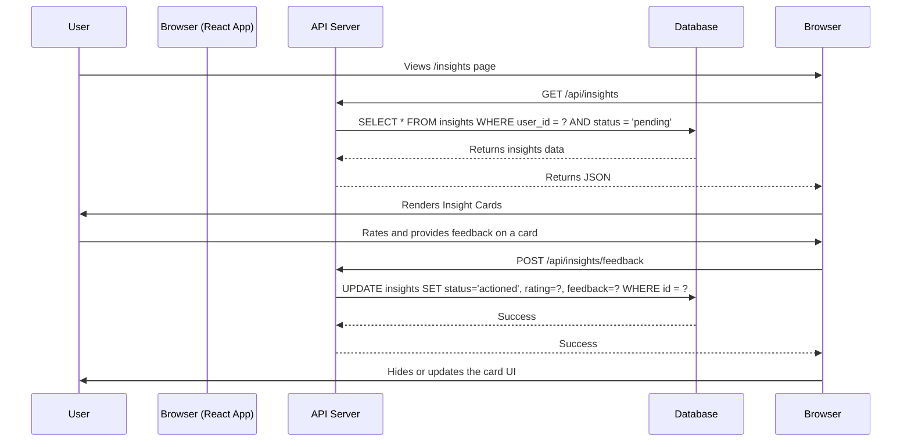

# System Design: Insights & Parts Garden

**Status:** Draft v1.0
**Date:** 2025-08-28

## 1. Overview

This document outlines the technical design for the "Insights & Parts Garden" feature set, as specified in the Product Requirements Document (PRD). The implementation will follow an **"AI Scaffolding"** model, meaning all backend and frontend infrastructure will be built to support the full feature set, but the AI-driven content generation will be mocked.

The core components of this feature set are:
1.  **A daily insight generation system.**
2.  **A user-facing "Insights Tab"** to view and interact with generated insights.
3.  **A "Parts Garden"** to view and manage discovered parts.
4.  **Backend services** to support these features.

## 2. Database Schema

Two new tables will be added to the Supabase Postgres database.

### 2.1. `insights` Table

This table stores the AI-generated insights presented to the user.

```sql
CREATE TABLE insights (
    id UUID PRIMARY KEY DEFAULT uuid_generate_v4(),
    user_id UUID NOT NULL REFERENCES users(id) ON DELETE CASCADE,
    source_session_id UUID REFERENCES sessions(id) ON DELETE SET NULL,
    type TEXT NOT NULL DEFAULT 'observation' CHECK (type IN ('session_summary', 'part_discovery', 'part_refinement', 'nudge', 'follow_up')),
    status TEXT NOT NULL DEFAULT 'pending' CHECK (status IN ('pending', 'viewed', 'actioned', 'dismissed')),
    content TEXT NOT NULL,
    user_rating INTEGER CHECK (user_rating >= 1 AND user_rating <= 5),
    user_feedback TEXT,
    created_at TIMESTAMP WITH TIME ZONE DEFAULT NOW(),
    updated_at TIMESTAMP WITH TIME ZONE DEFAULT NOW()
);

-- Indexes
CREATE INDEX idx_insights_user_id ON insights(user_id);
CREATE INDEX idx_insights_user_id_status ON insights(user_id, status);

-- RLS Policies
-- Users can only view and interact with their own insights.
```
**Justification:**
- A dedicated table is necessary to manage the lifecycle and feedback for each individual insight.
- `type` and `status` columns are crucial for filtering and driving UI logic.
- `user_rating` and `user_feedback` capture the explicit user interaction, which will be vital for future AI model fine-tuning.

### 2.2. `potential_refinements` Table

This table supports the "Patient Persistence" logic for Part Refinement suggestions that the user denies.

```sql
CREATE TABLE potential_refinements (
    id UUID PRIMARY KEY DEFAULT uuid_generate_v4(),
    user_id UUID NOT NULL REFERENCES users(id) ON DELETE CASCADE,
    part_id UUID NOT NULL REFERENCES parts(id) ON DELETE CASCADE,
    suggestion_details JSONB NOT NULL,
    status TEXT NOT NULL DEFAULT 'denied' CHECK (status IN ('denied', 're-evaluating')),
    denied_at TIMESTAMP WITH TIME ZONE DEFAULT NOW(),
    last_evaluated_at TIMESTAMP WITH TIME ZONE
);
```
**Justification:**
- This table prevents the system from losing valuable (but unconfirmed) hypotheses from the AI.
- It allows the system to implement a "cool-down" period and re-evaluate suggestions when more evidence is gathered, making the AI feel more patient and intelligent.

## 3. Backend Architecture

### 3.1. Mock Insight Generation Service

A new daily job will be responsible for populating the `insights` table.

- **Trigger:** Cron job (e.g., pg_cron) running once every 24 hours.
- **Logic:**
    1. For each active user, check the number of `pending` insights.
    2. If fewer than 3, calculate how many new insights to generate.
    3. Call a `mockInsightGenerator()` function.
    4. This function will contain business logic to decide which type of mock insight to create (e.g., 70% `session_summary`, 15% `part_discovery`, 10% `nudge`, 5% `follow_up`).
    5. The function will return placeholder content for the chosen type (e.g., "This is a placeholder for a Part Discovery card.").
    6. The service will insert the new mock insight(s) into the `insights` table.

### 3.2. API Endpoints

A set of new API endpoints will be created to support the frontend.

**1. Fetch Insights**
- `GET /api/insights`
- **Response:** A JSON array of the user's pending insights.
```json
[
  {
    "id": "...",
    "type": "session_summary",
    "content": "This is a placeholder for a session summary insight."
  }
]
```

**2. Submit Insight Feedback**
- `POST /api/insights/feedback`
- **Request Body:**
```json
{
  "insightId": "...",
  "rating": 4,
  "feedback": "This was helpful."
}
```
- **Action:** Updates the corresponding row in the `insights` table, setting its status to `actioned`.

**3. Part Discovery/Refinement Flow**
- `POST /api/parts/confirm-discovery`
- **Request Body:**
```json
{
  "insightId": "...",
  "confirmation": true,
  "partDetails": { "name": "The Procrastinator", "description": "..." }
}
```
- **Action:** If `confirmation` is true, creates a new entry in the `parts` table. Updates the insight status.

## 4. Frontend Architecture

### 4.1. `Insights` Page (`/insights`)
- **Container Component:** `InsightsPage.tsx`
    - Fetches data from the `GET /api/insights` endpoint.
    - Manages the state of the insights queue.
    - Renders a list of `InsightCard` components.
- **Presentational Component:** `InsightCard.tsx`
    - Receives a single insight object as a prop.
    - Renders the `content` of the insight.
    - Contains the UI for rating and feedback.
    - Calls the `POST /api/insights/feedback` endpoint on submission.
    - Will have specialized variants for `part_discovery` and `part_refinement` types, presenting different UI and actions.

### 4.2. `PartsGarden` Page (`/garden`)
- **Container Component:** `PartsGardenPage.tsx`
    - Fetches a list of all confirmed parts for the user from a new `/api/parts` endpoint.
    - Renders a grid or list of `PartCard` components.
- **Presentational Component:** `PartCard.tsx`
    - Displays a summary of a single part (e.g., name, emoji).
    - Links to the `PartDetailPage`.

### 4.3. `PartDetail` Page (`/garden/[partId]`)
- **Container Component:** `PartDetailPage.tsx`
    - Fetches detailed information for a single part from `/api/parts/[partId]`.
    - Renders the part's story, attributes, and a timeline of its interactions.
    - Includes the "Chat with this Part" button.

## 5. Data Flow Diagram: Insight Feedback Loop


